# 🚢 Cargoport Simulation

[](https://isocpp.org/)
[](https://www.opengl.org/)
[](https://opensource.org/licenses/MIT)
[](#)

## Project Overview

An animated real-time simulation of a bustling industrial cargo port — created using **C++** and **OpenGL**. Developed as a part of the **CSC4118 Computer Graphics** course at **AIUB**, this project showcases the core principles of graphics, modular animation and real-time rendering.

### What Does This Project Do?

This application simulates a fully functional cargo port with multiple animated entities including ships, cranes, trucks, and containers. The simulation features a dynamic day-night cycle with weather effects, realistic lighting changes, and environmental sounds to enhance immersion. It demonstrates advanced graphics concepts such as transformations, hierarchical modeling, collision detection, and environmental rendering.

### Challenges and Features Implemented

- **Challenge**: Managing multiple complex animated hierarchies (ship crane movements, truck navigation)
  - **Solution**: Implemented modular animation system with matrix transformations
- **Challenge**: Creating realistic lighting with day/night transitions and rain effects
  - **Solution**: Custom lighting calculations with environmental weather simulation
- **Challenge**: Coordinated container movements between ships and trucks
  - **Solution**: State machine-based animation sequencing

### Future Enhancements

- Port automation with pathfinding algorithms
- Advanced physics simulation for realistic ship movements
- Multi-threaded rendering for improved performance
- Support for custom port configurations and scenarios

---

## 📑 Table of Contents

- [Simulation Gallery](#-simulation-gallery)
- [Features](#-features)
- [Technologies Used](#-technologies-used)
- [Installation & Setup](#-installation--setup)
- [How to Run](#-how-to-run)
- [How to Use](#-how-to-use)
- [User Guide](#-user-guide)
- [Credits & References](#-credits--references)
- [License](#-license)

---

## 📷 Simulation Gallery

### Scenario 1

| Morning View                    | Night View                      |
| ------------------------------- | ------------------------------- |
| 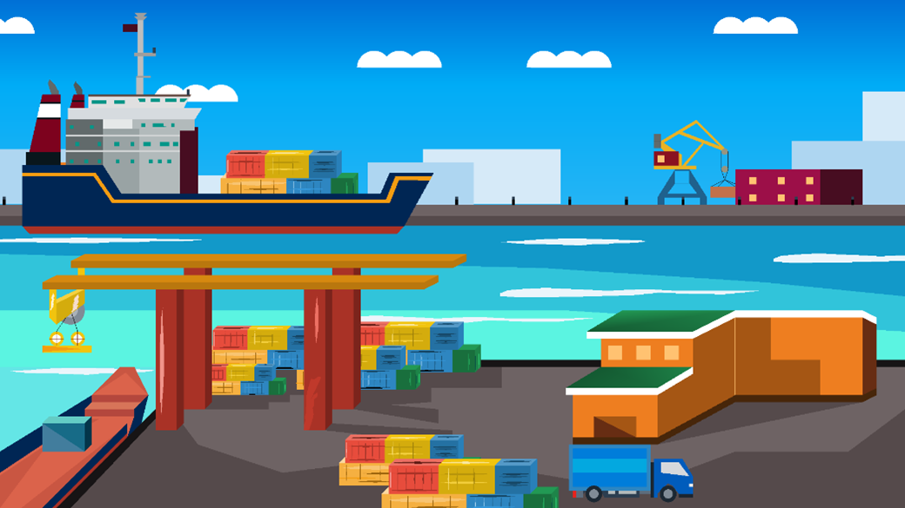 | 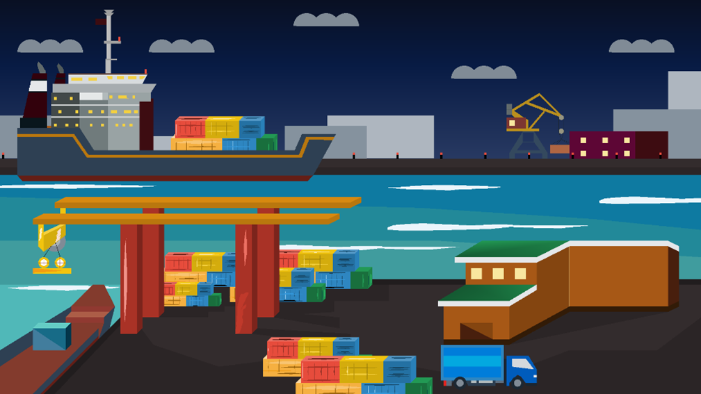 |

| Morning with Rain               | Night with Rain                 |
| ------------------------------- | ------------------------------- |
| 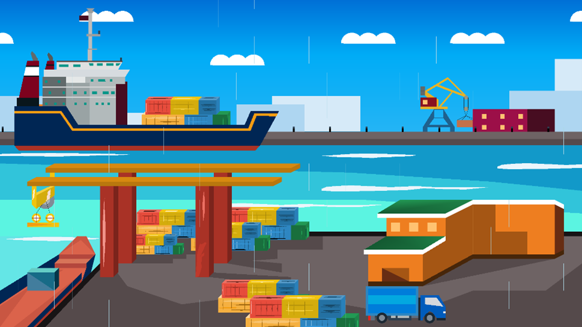 | 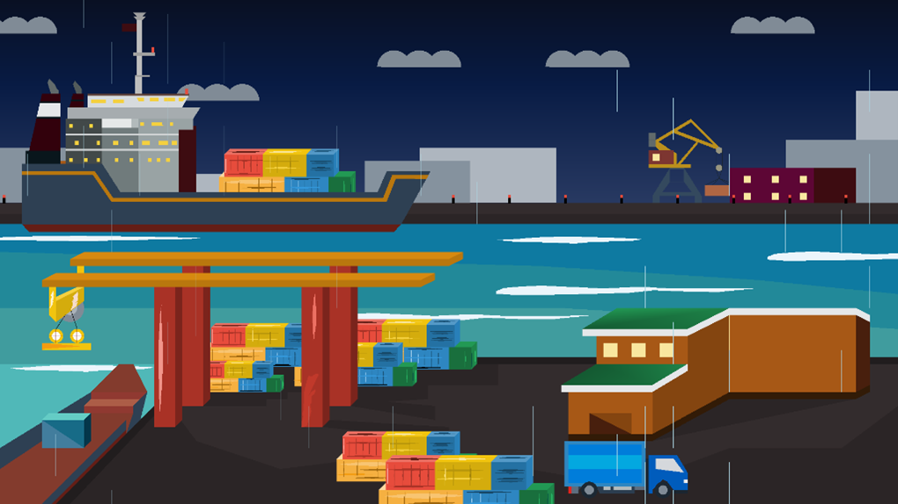 |

---

### Scenario 2

| Morning View                    | Night View                      |
| ------------------------------- | ------------------------------- |
|  |  |

| Morning with Rain               | Night with Rain                 |
| ------------------------------- | ------------------------------- |
| 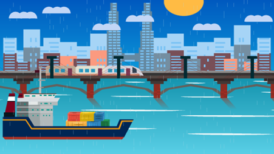 |  |

---

### Scenario 3

| Morning View                     | Night View                       |
| -------------------------------- | -------------------------------- |
| 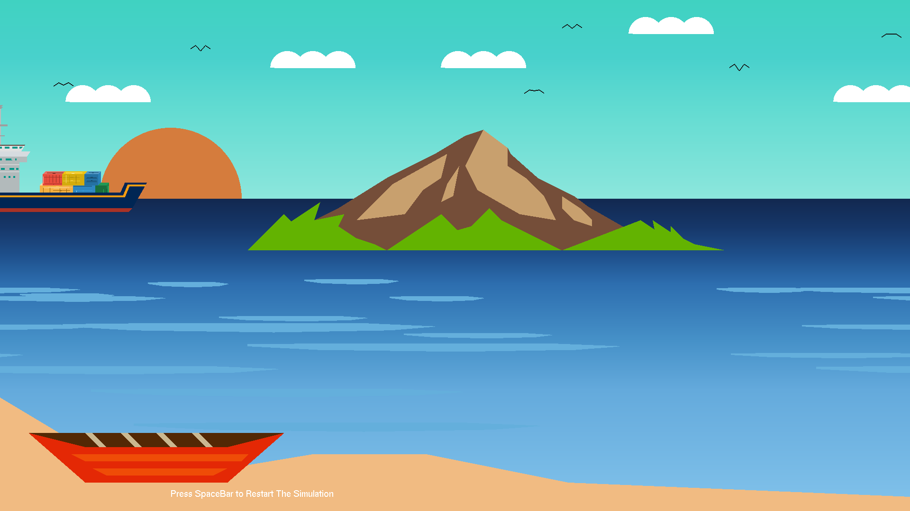 | 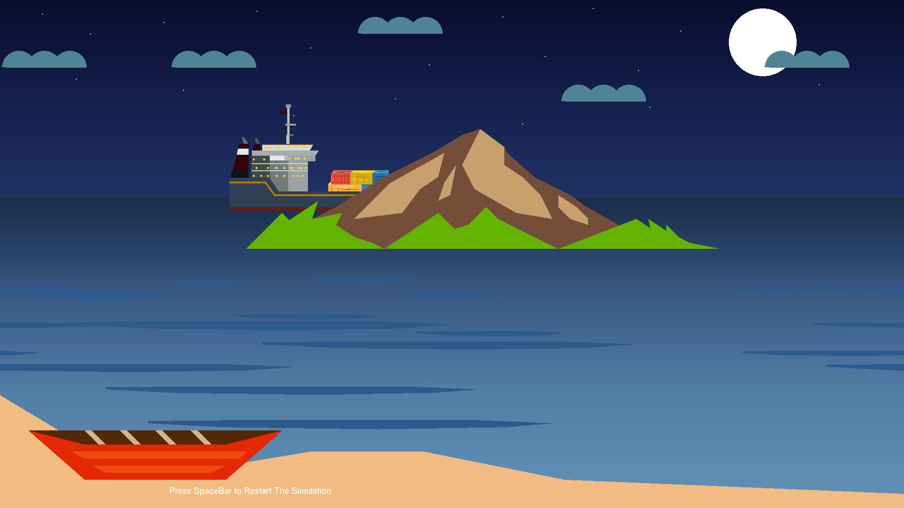 |

| Morning with Rain                | Night with Rain                  |
| -------------------------------- | -------------------------------- |
| 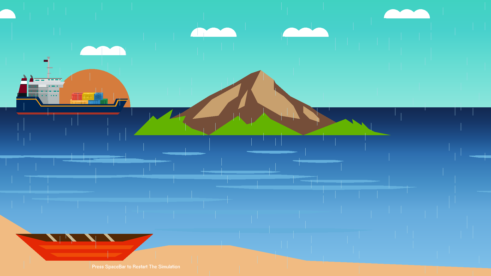 | 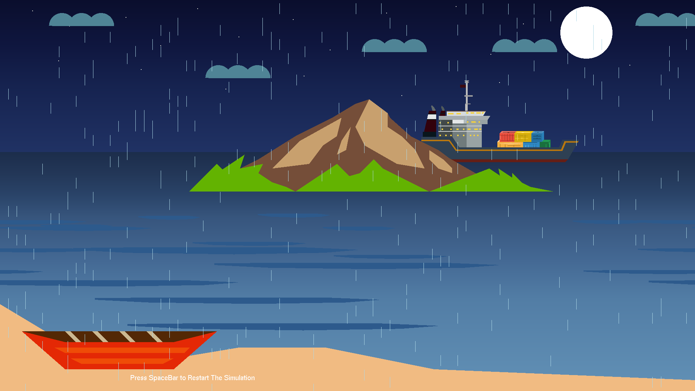 |

---

### Dynamic Actions

| Ship Movement                   | Truck Movement                   |
| ------------------------------- | -------------------------------- |
| 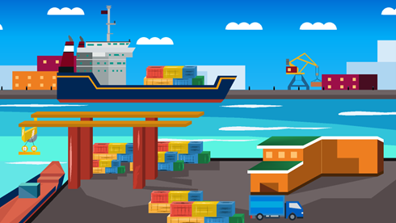 | 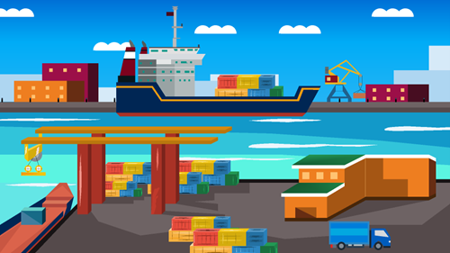 |

| Container Pickup                 | Container Release                |
| -------------------------------- | -------------------------------- |
| 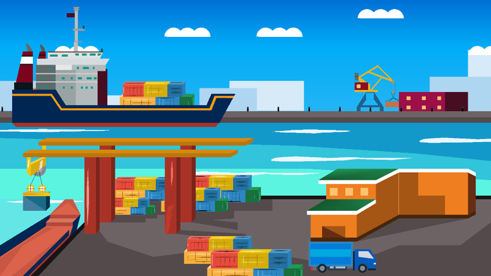 | 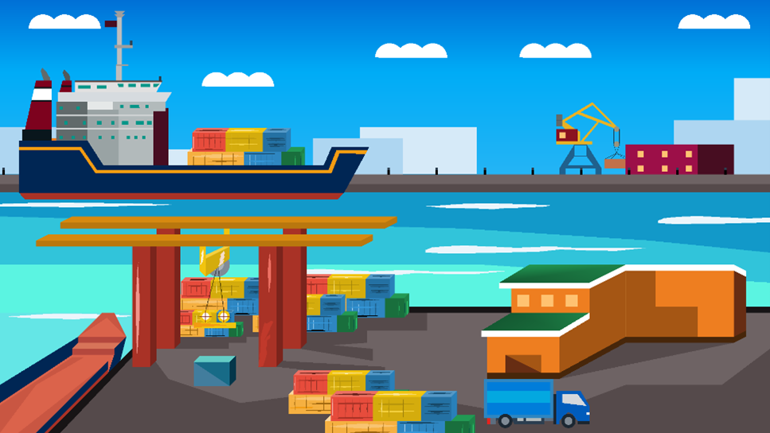 |

---

## 📖 User Guide

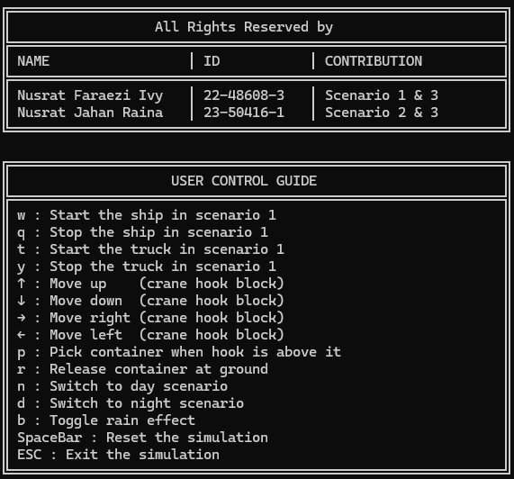

---

---

## 🛠️ Technologies Used

- **Language:** C++
- **Graphics API:** OpenGL (Immediate Mode)
- **Framework:** GLUT
- **IDE:** Code::Blocks
- **Platform:** Windows 10
- **Audio:** WAV playback using basic sound libraries

---

## 📦 Installation & Setup

### Prerequisites

Ensure you have the following installed on your system:

- **Windows 10 or later** (primary development platform)
- **Code::Blocks IDE** (or any C++ IDE with OpenGL support)
- **MinGW/G++ Compiler** (included with Code::Blocks)
- **OpenGL Libraries** and **GLUT**
- **Visual C++ Redistributable** (if running compiled binaries)

### Step-by-Step Installation

1. **Clone or Download the Project**

   ```bash
   git clone https://github.com/ivyfaraezi/Cargoport-Simulation.git
   cd Cargoport-Simulation
   ```

2. **Open the Project in Code::Blocks**
   - Launch Code::Blocks
   - Open `PROJECT.cbp` file from the project directory

3. **Configure Project Settings** (if needed)
   - Go to `Project` → `Build Options`
   - Ensure compiler is set to GNU GCC Compiler
   - Verify OpenGL and GLUT libraries are linked:
     - Add libraries: `opengl32`, `glu32`, `glut32`

4. **Build the Project**
   - Press `Ctrl + F9` or go to `Build` → `Build Project`
   - Check the build log for any errors

5. **Run the Simulation**
   - Press `Ctrl + F10` or click the Run button
   - The cargo port simulation window should launch

### Installing Required Libraries (if not present)

**For OpenGL and GLUT on Windows:**

- Download GLUT binaries from [OpenGL.org](https://www.opengl.org/)
- Place header files in `MinGW/include/GL/`
- Place library files in `MinGW/lib/`

---

## 🚀 How to Run

### Running from Code::Blocks

1. Open the project (`PROJECT.cbp`)
2. Build the project (`Ctrl + F9`)
3. Run the program (`Ctrl + F10`)

### Running the Compiled Executable

1. Navigate to `bin/Debug/` folder
2. Double-click `PROJECT.exe` to launch the simulation

### Troubleshooting

- **Window won't open:** Ensure OpenGL drivers are up-to-date
- **Missing GLUT errors:** Install GLUT libraries and update library paths in project settings
- **Audio not playing:** Verify WAV files exist in the music directory

---

## 📖 Features

- Real-time simulation of a cargo port
- Modular animation of:
  - Ships with crane systems
  - Industrial cranes for container handling
  - Trucks for container transport
  - Containers with realistic physics
- Dynamic day and night cycle with smooth transitions
- Rain effects with environment lighting adjustments
- Environmental sounds for immersive experience
- Multiple visualization scenarios (3 different port configurations)
- Interactive camera controls for multiple viewing angles

---

## 🎓 Credits & References

### Project Team

- **Nusrat Faraezi Ivy** (22-48608-3) - Lead Graphics Programmer
- **Nusrat Jahan Raina** (23-50416-1) - Lead Animation Developer

### Instructor & Institution

- **Course Instructor:** 
- **Institution:** American International University-Bangladesh (AIUB)
- **Course:** Computer Graphics (CSC4118)


## 📄 License

This project is licensed under the **MIT License** - see the LICENSE file for details.

### MIT License Summary

This license permits:

- ✅ Commercial use
- ✅ Modification
- ✅ Distribution
- ✅ Private use

With the following conditions:

- ⚠️ License and copyright notice must be included

**Disclaimer:** This software is provided "as is" without warranty of any kind. The authors assume no liability for any damages caused by the use or misuse of this software.

---
